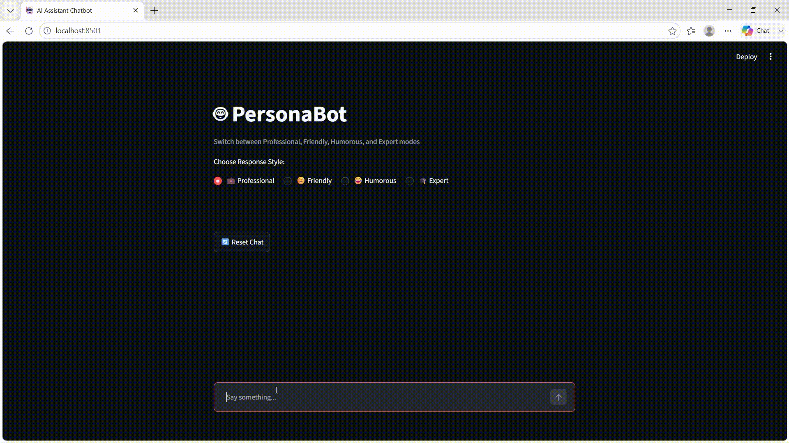

# 🤖 PersonaBot — Multi-Persona AI Chatbot




## ☁️ Deployed on Streamlit Cloud 

> 🌐 **Live App:** [personabot-ai.streamlit.app]( https://personabot-ai.streamlit.app/)

A Streamlit-based conversational AI chatbot that adapts its tone and style based on a selected persona. Powered by **LLaMA 3.3 70B** via **Groq** and built with **LangChain**.

---

## ✨ Features

- **4 Response Personas** — switch between Professional, Friendly, Humorous, and Expert modes
- **Persistent Chat Memory** — full conversation history maintained per session
- **Instant Persona Switch** — switching modes automatically resets context with the new system prompt
- **Clean UI** — built with Streamlit's native chat components
- **Groq-powered** — ultra-fast inference with LLaMA 3.3 70B Versatile

---

## 🎭 Personas

| Mode | Description |
|------|-------------|
| 💼 **Professional** | Clear, concise, well-structured responses |
| 😊 **Friendly** | Warm, approachable, conversational tone |
| 😂 **Humorous** | Witty remarks and light jokes with useful answers |
| 🎓 **Expert** | Detailed, insightful explanations with examples |

---

## 🗂️ Project Structure

```
personabot/
├── PersonaBot.py               # Main Streamlit application
├── requirements.txt     # Python dependencies
├── assets/
│   └── demo.gif
├── .gitignore           # Excludes .env and cache files
├── LICENSE              # MIT License
└── README.md            # Project documentation
```

...

> ⚠️ The actual `.env` file is **never committed**. Only `.env.example` (with no real keys) is included in the repo.

---

## 🚀 Getting Started

### 1. Clone the Repository

```bash
git clone https://github.com/AtharvaVSawant/personabot.git
cd personabot
```

### 2. Create a Virtual Environment

```bash
python -m venv venv

# Windows
venv\Scripts\activate

# macOS/Linux
source venv/bin/activate
```

### 3. Install Dependencies

```bash
pip install -r requirements.txt
```

### 4. Set Up Your API Key

```bash
cp .env.example .env
```

Open the newly created `.env` file and add your Groq API key:

```
GROQ_API_KEY=your_groq_api_key_here
```

> 🔑 Get a **free** API key at [console.groq.com/keys](https://console.groq.com/keys)  
> ⚠️ Never share or commit your `.env` file — it is already excluded via `.gitignore`

### 5. Run the App

```bash
streamlit run PersonaBot.py
```

The app will open at `http://localhost:8501`

---

## 🛠️ Tech Stack

| Technology | Purpose |
|-----------|---------|
| [Streamlit](https://streamlit.io/) | Web UI framework |
| [LangChain](https://langchain.com/) | LLM orchestration & message management |
| [Groq](https://groq.com/) | LLM inference API |
| [LLaMA 3.3 70B](https://huggingface.co/meta-llama/Llama-3.3-70B-Instruct) | Underlying language model |
| [python-dotenv](https://pypi.org/project/python-dotenv/) | Loads API key from `.env` file locally |

---

## ☁️ Deploy on Streamlit Cloud (Free)

1. Push this repo to your GitHub
2. Go to [share.streamlit.io](https://share.streamlit.io/) and sign in with GitHub
3. Select your repo → set **Main file** to `app.py`
4. Click **Advanced Settings → Secrets** and add:
   ```toml
   GROQ_API_KEY = "your_groq_api_key_here"
   ```
5. Click **Deploy** 🎉

> On Streamlit Cloud you do **not** use a `.env` file — the secret is set in the dashboard instead.

---

## 🤝 Contributing

Pull requests are welcome! For major changes, please open an issue first to discuss what you'd like to change.

---

## 📄 License

This project is licensed under the [MIT License](LICENSE).

---

## 👤 Author

**Atharva V Sawant**  
GitHub: [@AtharvaVSawant](https://github.com/AtharvaVSawant)
